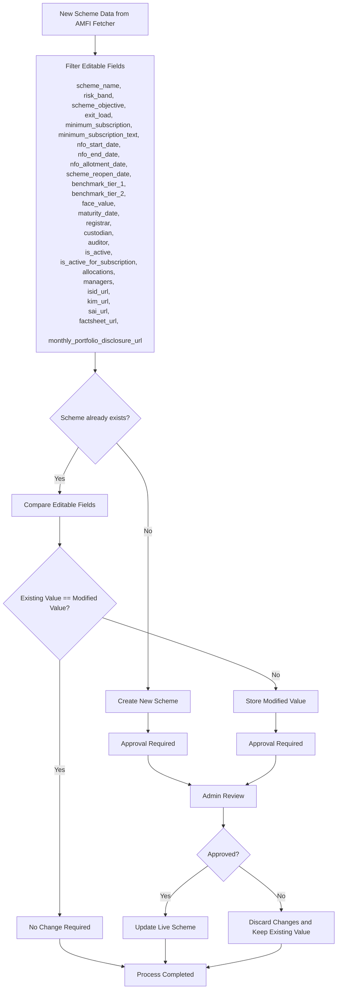

for confirmation

```mermaid
flowchart TD

    A[New Scheme Data from AMFI Fetcher]

    A --> B["Filter Editable Fields

    scheme_name,
    risk_band,
    scheme_objective,
    exit_load,
    minimum_subscription,
    minimum_subscription_text,
    nfo_start_date,
    nfo_end_date,
    nfo_allotment_date,
    scheme_reopen_date,
    benchmark_tier_1,
    benchmark_tier_2,
    face_value,
    maturity_date,
    registrar,
    custodian,
    auditor,
    is_active,
    is_active_for_subscription,
    allocations,
    managers,
    isid_url,
    kim_url,
    sai_url,
    factsheet_url,
    monthly_portfolio_disclosure_url"]

    B --> C{Scheme already exists?}

    C -- No --> D[Create New Scheme]
    D --> E[Approval Required]
    E --> F[Admin Review]

    C -- Yes --> G[Compare Editable Fields]

    G --> H{Existing Value == Modified Value?}

    H -- Yes --> I[No Change Required]

    H -- No --> J[Store Modified Value]
    J --> K[Approval Required]
    K --> F

    F --> L{Approved?}

    L -- Yes --> M[Update Live Scheme]

    L -- No --> N[Discard Changes and Keep Existing Value]

    I --> O[Process Completed]
    M --> O
    N --> O
```
